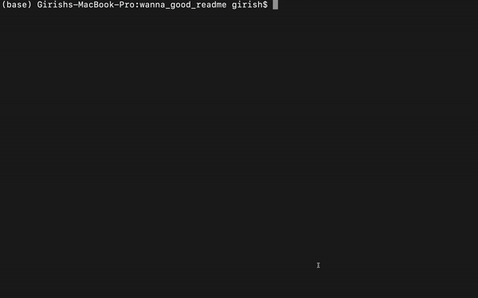

# wanna_good_readme

## Table of Contents
- [Task](#task)
- [Description](#description)
- [GIF](#gif)
- [Website](#website)

## Task
The purpose of this task was to create a high-quality README.md file through the command-line. It puts out the questions in the command line from which the answers of those questions are used to create the README. The project tile will be the title of the README and license of the application is chosen for a list of options. The license badge is also added to the near the top of the README.

## Description 
This can be used to create a README for your repo. You will need to install the necessary packages in order to use it. In this project we have to used the inquirer package to create a prompt in the command line as a questionnaire and also the fs package for writing everything to a file. The markdown of how the README should look is in the utils folders. The new README generated is also in the utils package as i didn't want it to overlap with this project's README.  

## GIF

  
  
Fig: whole demo of the README generator

   

## Website
https://github.com/gmadnani/wanna_good_readme

